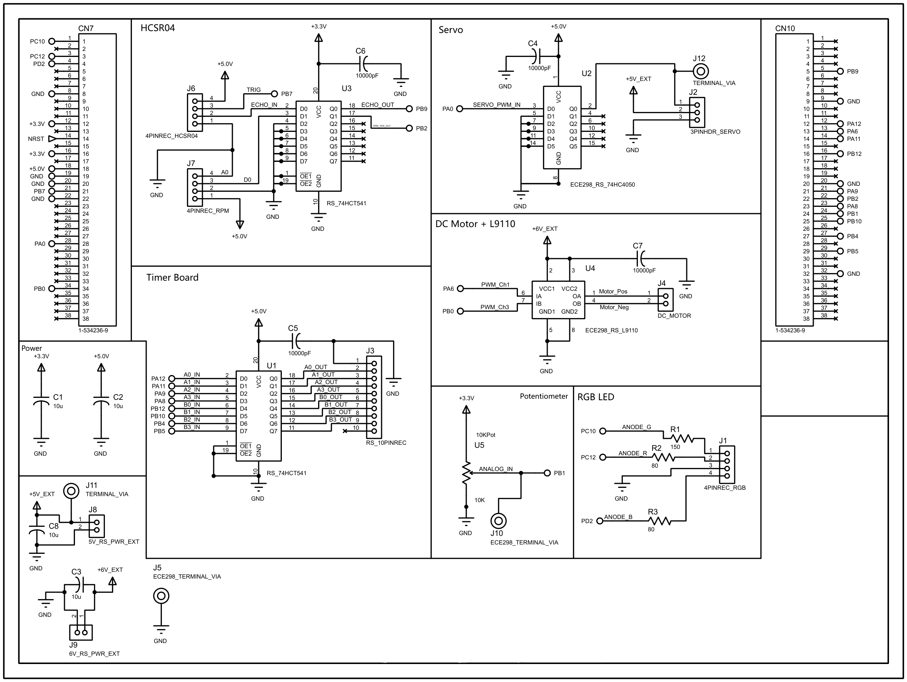
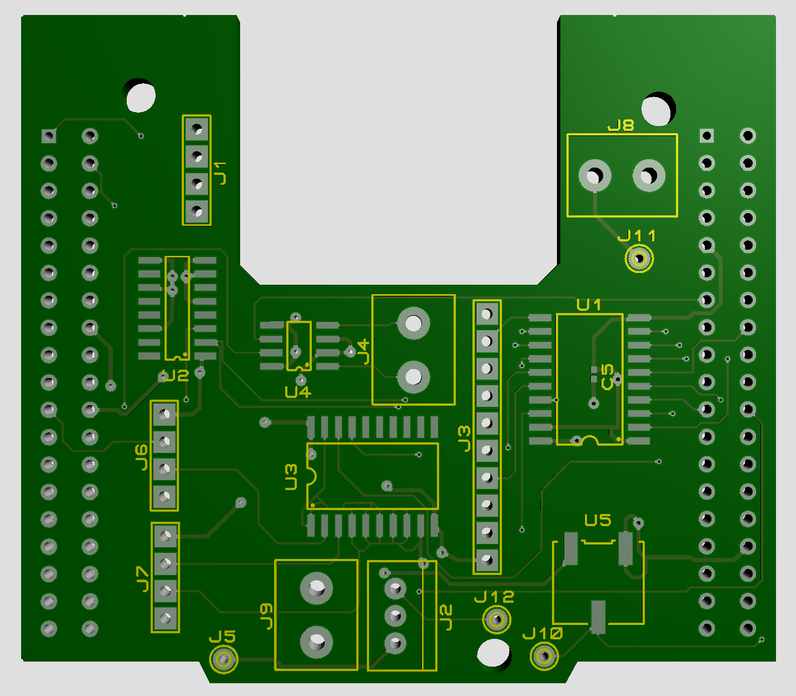
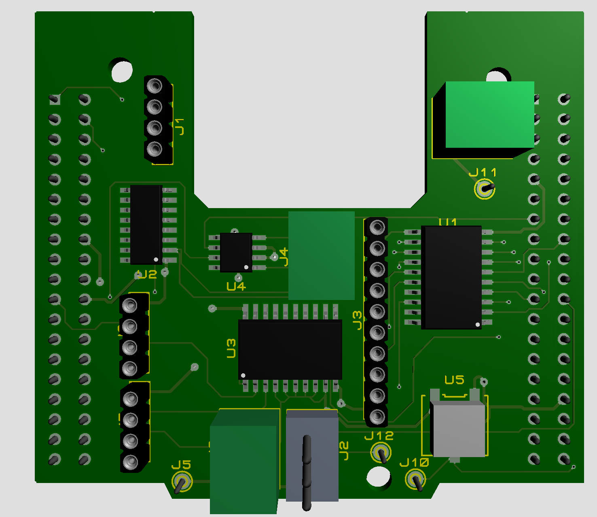

# STM32 Irrigation Controller

An embedded controller for a multi-zone irrigation system, built on the STM32 Nucleo-F401RE. The system manages a single pump and servo-driven distributor to fill a reservoir from an underground spring and irrigate three terraced zones at different elevations, all within a 24-hour cycle.

Developed for ECE 298 (Instrumentation & Prototyping Laboratory) at the University of Waterloo, Fall 2025.

---

## Features

* **Two-mode state machine** - `SETUP` mode for parameter entry over UART, `RUN` mode for autonomous 24-hour operation (scaled for demo purposes).
* **Configurable scheduling** - User specifies start/stop hours and pump speed (PWM duty cycle) for each of 4 pipelines (1 inlet + 3 zones) via serial terminal.
* **Manual control option** - Inlet pump speed can be driven by a potentiometer through ADC, mapped to PWM duty cycle in real time.
* **Servo-driven water distributor** - RGB LED indicates the active pipeline (purple/red/green/blue); servo rotates to the corresponding zone.
* **Real-time RPM measurement** - RPM pulses counted via GPIO interrupt over a fixed real-time interval (independent of the scaled simulation clock).
* **Ultrasonic depth sensing** - HC-SR04 driven by timer input capture; reservoir depth displayed as a percentage on a 7-segment timer board and over UART.
* **Empty-reservoir fault handling** - Motor shutoff and flashing white RGB indicator if the reservoir hits 0% during operation.

---

## Hardware

|Component|Role|
|-|-|
|STM32 Nucleo-F401RE|Main controller (ARM Cortex-M4)|
|L9110 motor driver + brushed DC motor|Pump, dual-direction PWM|
|SG90 servo motor|Water distributor selector|
|HC-SR04 ultrasonic sensor|Reservoir depth measurement|
|RPM Sensor + slotted wheel|RPM feedback on motor shaft|
|Lab Timer Board (dual 7-segment)|Water depth percentage display|
|RGB LED|Active pipeline indicator|
|Potentiometer|Manual speed control (inlet only)|

A custom 2-layer shield PCB was designed in Proteus to stack onto the Nucleo header. The board was not fabricated due to course timeline constraints.

---

## Hardware Design

### Schematic



### PCB Layout




---

## Architecture

### Peripherals

|Timer|Function|
|-|-|
|TIM2 CH1|Servo PWM (50 Hz, 1–2 ms pulse width)|
|TIM3 CH1/CH3|DC motor PWM (forward / reverse via L9110)|
|TIM4 CH4|HC-SR04 echo input capture (both edges)|
|TIM5|Scaled wall-clock tick (12 s = 1 simulated hour)|


|Other|Function|
|-|-|
|ADC1 CH9|Potentiometer read (8-bit resolution)|
|USART2|Terminal I/O at 115200 baud|
|EXTI (RPM\_TICK pin)|RPM pulse counter|
|GPIO|7-segment digit drive, RGB LED, mode LED, B1 button|

### Control flow

1. **Reset** → `SETUP` mode. Green LED off. UART prompts for pipeline assignments, PWM options, and start/stop hours for each of 4 pipelines.
2. Setup parameters echoed back to terminal. Green LED flashes; system waits for B1 (blue user button).
3. **B1 press** → `RUN` mode. Green LED solid on. Scaled clock starts at hour 0.
4. Each simulated hour: select active pipeline based on schedule, set servo + RGB + motor PWM, sample reservoir depth, measure RPM over real-time window, log status row to UART, update 7-segment display.
5. **Hour 24** → motor off, green LED off, system halts until reset.
6. **Reservoir empty event** → immediate motor shutoff, flashing white RGB, halt until reset.

### Status output

Hourly rows logged to UART in the format:

```
CLOCK : PIPE : PWM : RPM : DEPTH :
   0  :  0  :  0  : 142 :  87  :
   1  :  0  :  0  : 138 :  91  :
   ...
```

---

## What I'd Do Differently

This was a course project on a fixed timeline. With more time:

* **Revamp SETUP mode UART handling.** The blocking receive pattern is repeated for every prompt. A helper function or parameter table would clean this up significantly.
* **Use a struct for pipeline state.** Pipelines are tracked as parallel variables (`pipeA`, `pwmA`, `firstA`, `lastA`) instead of a single `Pipeline` struct, which inflates the schedule logic and makes adding pipelines tedious.
* **The PCB is unverified** - designed but not fabricated, so layout issues haven't been caught in hardware.

